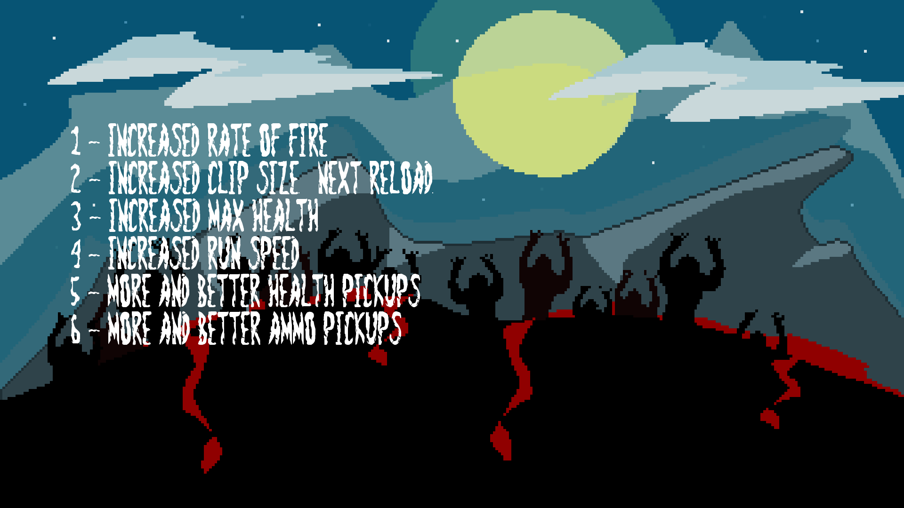

# Zombie Arena

Welcome to Zombie Arena, an adrenaline-fueled survival game where you must fight for your life against hordes of the undead. Inspired by classic zombie shooters and built using C++11 and SFML, Zombie Arena offers intense gameplay, strategic decision-making, and heart-pounding action.

## Gameplay Features:

### Intense Combat:
- Face off against relentless waves of zombies, each more challenging than the last.
- Use your wits, reflexes, and firepower to survive the onslaught.

### Dynamic Movement:
- Navigate through the game world using the WASD keys.
- Adjust your view and aim using the mouse, ensuring precise shots and strategic positioning.

### Resource Management:
- Collect health and ammo pickups to replenish your resources and stay in the fight.
- Reload your weapon (press R) to ensure you're always ready to take on the horde.

### Level Up:
- Choose upgrades at the start of each level to customize your gameplay experience.
- Experiment with different strategies to find the most effective way to survive.

### High Score Challenge:
- Compete against yourself and others to beat your high score.
- Test your skills and see how long you can last against the relentless zombie horde.

## Controls:

- **Enter:** Start or pause the game.
- **W/A/S/D:** Move your character.
- **Mouse:** Adjust your view and aim.
- **Left Mouse Button:** Shoot your weapon.
- **Num1 - Num6:** Level up the player at the start of each level.
- **R:** Reload your weapon.
- **Esc:** Exit the game.

## Installation:

1. Ensure you have C++11 installed on your system.
2. Download and install the SFML (x32 version) library.
3. Clone the Zombie Arena repository.
4. Set up the project in your preferred development environment (e.g., Visual Studio) following the provided instructions.
5. Build the project and run the game to start playing.

## Credits:

Zombie Arena is based on ideas and concepts from "Beginning C++ Game Programming" by John Horton. Special thanks to the SFML development team for providing the graphics library that powers the game.

